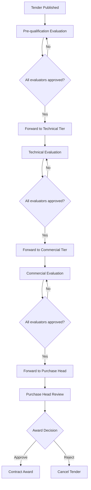

# Evaluation Committee System Implementation Plan

## Overview
This plan introduces two new user roles (`evaluator` and `purchase_head`) and a three‑tier evaluation committee (Pre‑qualification, Technical, Commercial) with tier‑specific field visibility and a sequential forwarding workflow.

## 1. New Roles & Permissions

| Role            | Description                                                                 |
|-----------------|-----------------------------------------------------------------------------|
| **evaluator**   | Member of one or more evaluation tiers; can view/score assigned tenders.    |
| **purchase_head** | Final commercial evaluator; can award contracts (extends `buyer` privileges). |

- Both roles are added to the existing `roles` array in the `users` table.
- Registration API (`/auth/register`) will still accept only `buyer` or `vendor`; evaluators and purchase heads must be assigned by an admin/buyer via user‑management endpoints.
- Authorization middleware (`authorize`) already accepts `evaluator` (existing) and will be extended for `purchase_head`.

## 2. Database Schema Changes

### 2.1 New Table: `tender_evaluation_committees`
Stores committee assignments per tender, per tier.

```sql
CREATE TABLE tender_evaluation_committees (
    id               UUID PRIMARY KEY DEFAULT gen_random_uuid(),
    tender_id        UUID NOT NULL REFERENCES tenders(id) ON DELETE CASCADE,
    user_id          UUID NOT NULL REFERENCES users(id),
    tier             TEXT NOT NULL CHECK (tier IN ('pre_qualification', 'technical', 'commercial')),
    status           TEXT NOT NULL DEFAULT 'pending'
                       CHECK (status IN ('pending', 'approved', 'forwarded')),
    assigned_by      UUID NOT NULL REFERENCES users(id),
    assigned_at      TIMESTAMPTZ NOT NULL DEFAULT now(),
    completed_at     TIMESTAMPTZ,
    forwarded_at     TIMESTAMPTZ,
    UNIQUE (tender_id, user_id, tier)
);

CREATE INDEX idx_tender_evaluation_committees_tender ON tender_evaluation_committees(tender_id);
CREATE INDEX idx_tender_evaluation_committees_user ON tender_evaluation_committees(user_id);
CREATE INDEX idx_tender_evaluation_committees_tier ON tender_evaluation_committees(tier);
```

### 2.2 New Tender Status
Add `pre_qual_eval` to `tender_status_master` (if not present) to represent the pre‑qualification evaluation phase.

```sql
INSERT INTO tender_status_master (code) VALUES ('pre_qual_eval') ON CONFLICT DO NOTHING;
```

Existing statuses (`draft`, `published`, `clarification`, `closed`, `tech_eval`, `comm_eval`, `awarded`, `cancelled`) remain unchanged.

### 2.3 Field‑Visibility Mapping
We will classify documents and form fields into three categories based on the `document_category` column of `tender_type_document_requirements` and extend the classification to other tender attributes (e.g., qualification responses, technical specifications, commercial offers).

| Tier                | Document Categories (examples)                                  | Associated Tables/Fields                                      |
|---------------------|----------------------------------------------------------------|---------------------------------------------------------------|
| **Pre‑qualification** | `legal`, `financial`, `experience`                            | `vendor_documents`, `bid_qualification_responses`, `tender_qualification_requirements` |
| **Technical**        | `technical`, `specifications`, `drawings`, `test_reports`     | `feature_definitions` (technical features), `bid_items` (compliance), `attachments` with technical scope |
| **Commercial**       | `tender_form`, `contract_form`, `price_schedule`              | `bid_items` (unit_price, item_total_price), `bid_envelopes` (commercial), `tax_rules` |

This mapping will be hard‑coded in a service (`visibility.service.ts`) that filters data per tier.

## 3. Workflow Diagram



**Key Points:**
- Each tier can have multiple evaluators; all must approve before forwarding.
- The buyer (or admin) can reassign evaluators at any time before forwarding.
- Notifications are sent on assignment, forwarding, and completion.

## 4. Backend Services & Endpoints

### 4.1 Committee Management Service
- `POST /tenders/:tenderId/committee` – assign evaluator(s) to tier(s)
- `GET /tenders/:tenderId/committee` – list all assigned evaluators per tier
- `DELETE /tenders/:tenderId/committee/:userId` – remove evaluator
- `POST /tenders/:tenderId/forward` – forward tender to next tier (requires all evaluators in current tier to have `approved` status)

### 4.2 Evaluator Dashboard Service
- `GET /evaluator/tenders` – list tenders where the authenticated user is assigned as evaluator, grouped by tier
- `GET /tenders/:tenderId/evaluation-data` – returns only the fields/documents visible to the user’s tier (via visibility service)

### 4.3 Evaluation Service Extension
- Extend `evaluation.service.ts` to support pre‑qualification evaluation (scoring of qualification responses).
- Add `pre_qualification_score` column to `evaluations` table (optional; can reuse `technical_score` with a different interpretation).
- Update evaluation creation to validate that the evaluator belongs to the correct tier for the tender’s current status.

### 4.4 Notification Service
- Notify evaluators when they are assigned to a tender.
- Notify next‑tier evaluators when a tender is forwarded.
- Notify purchase head when commercial evaluation is complete.

## 5. Frontend Components

### 5.1 Buyer Interface (Tender Management)
- New tab **“Evaluation Committee”** in the tender creation/edit page.
- Multi‑select component to pick existing users with `evaluator` or `purchase_head` roles, assign them to tiers.
- Visual indicator of current tier status and forwarding button (only visible when all evaluators have approved).

### 5.2 Evaluator Dashboard
- New tab **“My Evaluations”** in the main dashboard.
- Cards grouping tenders by tier (Pre‑qualification, Technical, Commercial).
- Clicking a card opens the evaluation interface with tier‑filtered fields.

### 5.3 Evaluation Interface
- A unified evaluation page that adapts content based on tier.
- Pre‑qualification: show vendor qualification documents and compliance checkboxes.
- Technical: show technical specifications, feature scoring, compliance remarks.
- Commercial: show price breakdown, tax calculations, commercial envelope details.
- **Approve** and **Forward** buttons (forward only available when all evaluators in tier have approved).

### 5.4 Purchase Head Interface
- Similar to evaluator dashboard but only for commercial‑tier tenders that have been forwarded.
- Final award decision buttons (Award / Reject) with justification input.

## 6. Integration with Existing Evaluation System

- The existing `evaluations` table already links `bid_id` and `evaluator_id`. We will add a `tier` column to distinguish between pre‑qualification, technical, and commercial evaluations (optional; can be inferred from tender status).
- The existing `tech_eval` and `comm_eval` tender statuses will be triggered automatically when the corresponding tier is forwarded.
- The existing envelope‑opening logic (`openTechnicalEnvelopes`, `unlockCommercialEnvelopes`) remains unchanged; pre‑qualification evaluation does not involve envelope opening.

## 7. Security & Validation

- **Role‑Based Access:** Middleware ensures only buyers/admins can assign committees; only assigned evaluators can view/score their tier’s data.
- **Field‑Level Security:** Visibility service filters out non‑relevant fields based on tier (implemented as a PostgreSQL view or application‑side filter).
- **Workflow Integrity:** Forwarding is allowed only when all assigned evaluators have approved; each tier must be completed sequentially.

## 8. Testing Strategy

1. **Unit Tests** – new services (committee management, visibility filtering).
2. **Integration Tests** – complete workflow from assignment to award.
3. **End‑to‑End Tests** – frontend interactions using Playwright.
4. **Regression Tests** – ensure existing evaluation features still work.

## 9. Deployment Steps

1. Run database migrations (new table, new status).
2. Update backend services and add new endpoints.
3. Build and deploy frontend components.
4. Seed test evaluators and purchase head users.
5. Run comprehensive test suite.

## 10. Risks & Mitigations

| Risk | Mitigation |
|------|------------|
| Performance impact of field‑level filtering | Use indexed views and caching; limit real‑time filtering to small datasets. |
| Complexity of tier‑specific UI | Start with a single adaptive component; iterate based on user feedback. |
| Conflict with existing evaluation logic | Keep pre‑qualification evaluation separate; extend rather than modify core evaluation tables. |

## 11. Success Metrics

- Evaluators can see only relevant fields (verified by QA).
- Forwarding works seamlessly across tiers.
- Purchase head can make award decisions without seeing technical/pre‑qualification details.

---

**Next Step:** Review this plan with stakeholders; upon approval, switch to Code mode and begin implementation according to the todo list.